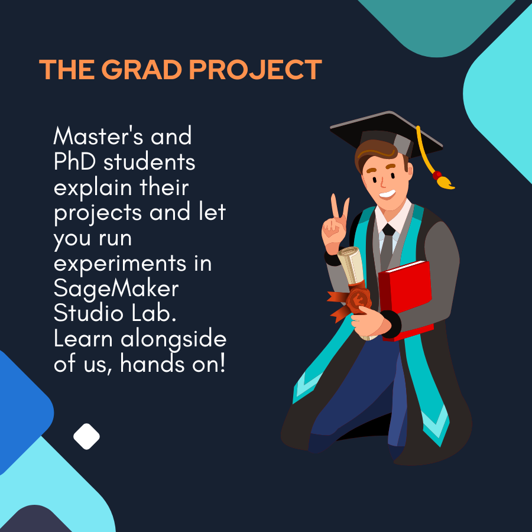

## The Grad Project

This repository contains code samples related to a series of video interviews conducted by AWS Developer Relations. Choose a notebook and open it in SageMaker Studio Labs using the 'Open in SageMaker' button. SageMaker Studio Labs is a free platform where you can run machine learning experiements. Note: it might take a few days for you to gain access to the Lab environment. Follow the notebook instructions for alternate paths to run the project.

|  Project Name | University  | Investigators  | Link  |   
|---|---|---|---| 
| Using Python and Data Analytics to Combat Systemic Racism  | MIT  | Ben Lewis, Jessy Han | link |
| Harnessing the Power of Text-to-SQL Machine Learning with Amazon SageMaker  | Carnegie Mellon University |  Vincent Xu | [link](https://github.com/vxcent/sagemaker_gap_demo/tree/main) |   

## Security

See [CONTRIBUTING](CONTRIBUTING.md#security-issue-notifications) for more information.

## License

This library is licensed under the MIT-0 License. See the LICENSE file.

