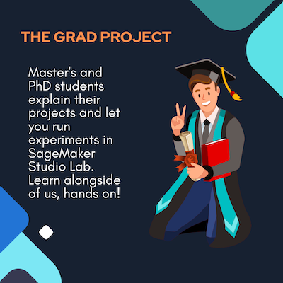

## The Grad Project

This repository contains code samples related to a series of video interviews conducted by AWS Developer Relations. Choose a notebook and open it in SageMaker Studio Labs using the 'Open in SageMaker' button. SageMaker Studio Labs is a free platform where you can run machine learning experiements. Note: it might take a few days for you to gain access to the Lab environment.

|  Project Name | University  | Investigators  | Link  |   
|---|---|---|---|
| Analyzing with archival photographs from the Boston Globe using Rekognition  | Northeastern University  | Giulia Tauino, Si Wu  | link  | 
| Mining data for systemic racism  | MIT  | Ben Lewis  | link  |
| Creating a Bot to convert written language to SQL queries  | Vincent Xu | Carnegie Mellon University |  link |   

## Security

See [CONTRIBUTING](CONTRIBUTING.md#security-issue-notifications) for more information.

## License

This library is licensed under the MIT-0 License. See the LICENSE file.

